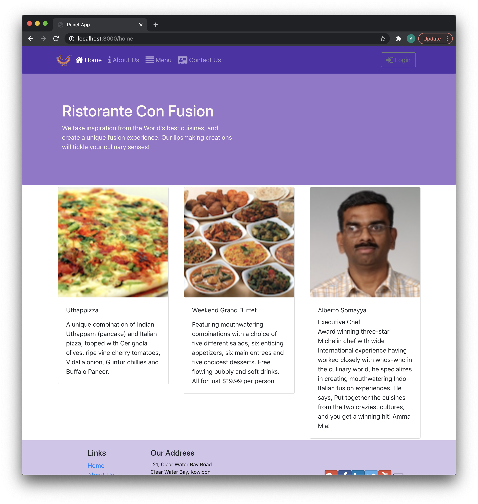
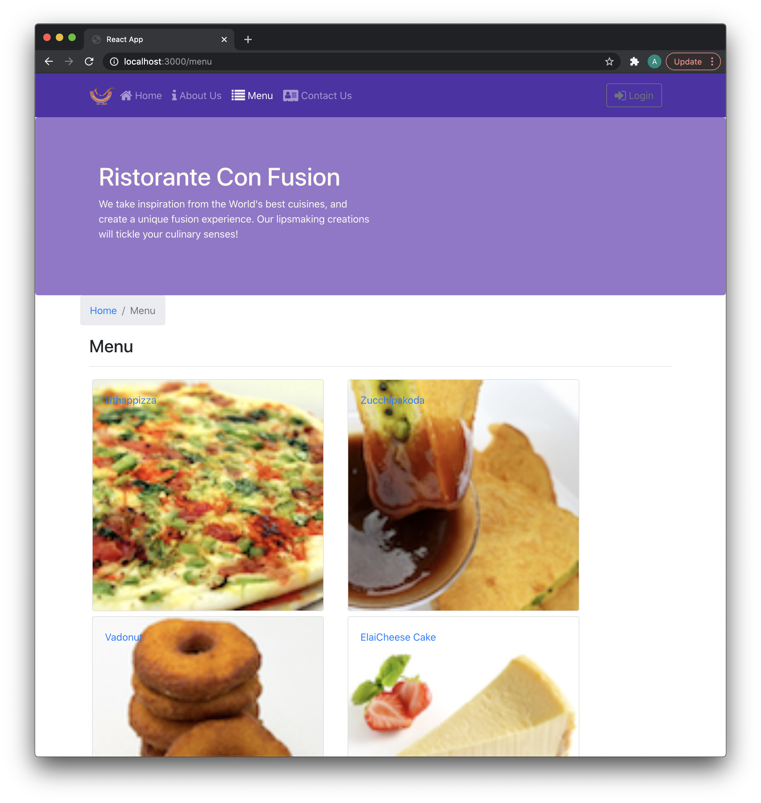
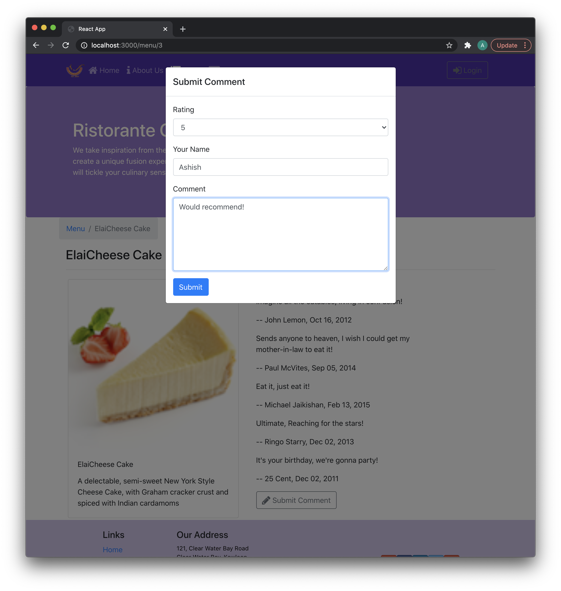

# [Front-End Web Development with React](https://www.coursera.org/learn/front-end-react/home/welcome): Restaurant Website

Code from Coursera (by The Hong Kong University of Science and Technology) and Ashish Ramachandran // 2020

## Introduction

The course focused on the development of a website for a hypothetical Indian fusion restaurant. As the students progressed through the course's modules and homework assignments, this site would be updated with the newly learned concepts. 

## About the Course

This course explores Javascript based front-end application development, and in particular the React library. The course provides an introduction to:
- **JavaScript ES6** for developing React application
- Use of **Reactstrap** for Bootstrap 4-based responsive UI design
- React **components**
- **React router** and its use in developing single-page applications
- Designing controlled forms
- **Flux architecture** and **Redux** to develop **React-Redux** powered applications
- Use **Fetch** for client-server communication and the use of **REST API** on the server side
- React **animation support**

Course site is here: [Front-End Web Development with React](https://www.coursera.org/learn/front-end-react/home/welcome)


## Concepts Learned

After the course, students are able to:
- Create client-side Javascript application development and the React library
- Implement single page applications in React
- Use various React features including components and forms
- Implement a functional front-end web application using React
- Use Reactstrap for designing responsive React applications
- Use Redux to design the architecture for a React-Redux application

## Running the Project

This project was bootstrapped with [Create React App](https://github.com/facebook/create-react-app).

The project contains server and client side components. 

To start the server, you can run:
```
cd json-server
json-server --watch db.json -d 2000 -p 3001  
```

This will start the json server monitoring the "db.json" file with a server delay of 2 seconds (arbitrary and not necessary) and running on port 3001. 

To start the client, in the project directory, you can run:

```
npm install
yarn start
```

Runs the app in the development mode.\
Open [http://localhost:3000](http://localhost:3000) to view it in the browser.

As part of the course, we also created a webpack so opening to [http://localhost:3001](http:/localhost:3001) would also show the site.

## Further Steps

Future development will include constructing a cleaner UI, exploring react components further and integrating more features around the server-side.

## Media



